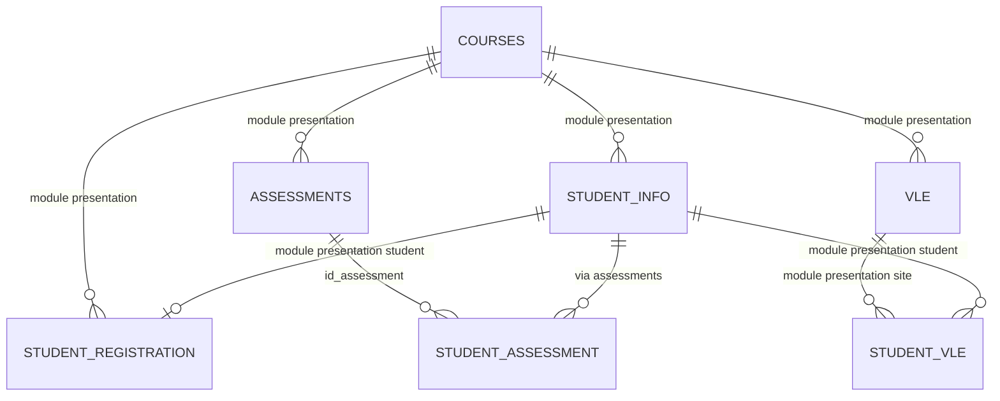

# 09 — Data dictionary và quan hệ 7 bảng OULAD

**Task:** T02.
**Trạng thái:** Đã kiểm tra bằng script trên bộ OULAD chính thức. Đây là hợp đồng từ CSV raw, không tự khẳng định dữ liệu đã sạch.

Nguồn, license, checksum và số dòng T01: [data README](../data/README.md). Bảy CSV ở `data/raw/` (không commit). Lệnh tái tạo kiểm tra trực tiếp raw bằng Python 3.14/thư viện chuẩn:

```powershell
python src/profile_oulad_contract.py data/raw
```

`?` là mã thiếu/không biết quan sát, khác ô trống; T02 giữ nguyên raw. Các ngày là ngày tương đối với đầu presentation, không phải ngày lịch. Hạt phân tích là **một lượt học** `(code_module, code_presentation, id_student)`; một `id_student` có thể có nhiều lượt học.

## Sơ đồ quan hệ và quy tắc join



`studentAssessment` và `studentVle` là event nhiều dòng: T07 phải nối metadata, giới hạn cửa sổ thời gian, **tổng hợp về hạt lượt học rồi** left join vào `studentInfo`. Không nối hai event trực tiếp hay cộng KPI sau join event để tránh nhân dòng.

| Kiểm tra trực tiếp raw | Kết quả | Trạng thái |
|---|---:|---|
| `courses` key | 22 unique; 0 null/duplicate | PASS |
| `studentInfo`, `studentRegistration` attempt key | 32.593 unique; 0 null/duplicate mỗi bảng; hai tập khóa khớp | PASS |
| `assessments.id_assessment`, `vle.id_site` | 206, 6.364 unique; 0 null/duplicate | PASS |
| `studentAssessment(id_assessment,id_student)` | 173.912 unique; 0 null/duplicate | PASS |
| 8 quan hệ join; component event key `studentVle` null | 0 unmatched; 0 null | PASS |
| Unique event key `studentVle` | Không khẳng định | Hạt event có thể lặp; T05 audit nghiệp vụ |

## Bảng và cột gốc

Ký hiệu missing trong bảng là `blank / ?`. Vai trò “feature tiềm năng” chỉ được dùng sau T07/T13 chốt cửa sổ thời gian và leakage.

### `courses.csv` — 22 dòng, 3 cột

**Hạt/khóa:** một module–presentation; `(code_module, code_presentation)`, đã unique/non-null.

| Cột | Kiểu raw | Giá trị / missing | Ý nghĩa, vai trò |
|---|---|---|---|
| `code_module` | string | 7 module; 0/0 | Mã học phần; join/filter. |
| `code_presentation` | string | 4 kỳ; 0/0 | Mã đợt mở; join/filter. |
| `module_presentation_length` | integer | 234–269; 0/0 | Độ dài đợt (ngày); metadata/cửa sổ thời gian. |

### `studentInfo.csv` — 32.593 dòng, 12 cột

**Hạt/khóa:** một lượt học; `(code_module, code_presentation, id_student)`, đã unique/non-null. Bảng neo kết quả, background và map.

| Cột | Kiểu raw | Giá trị / missing | Ý nghĩa, vai trò |
|---|---|---|---|
| `code_module`, `code_presentation`, `id_student` | string, string, integer | 0/0; `id_student` 3.733–2.716.795 | Khóa lượt học; không ghép định danh ngoài OULAD. |
| `gender` | string | `F`, `M`; 0/0 | Background/EDA; feature chỉ khi duyệt fairness. |
| `region` | string | 13 vùng; 0/0 | Vùng cư trú; map/EDA, GeoJSON mapping cần T04/T09. |
| `highest_education` | string | 5 mức; 0/0 | Trình độ đầu vào; background/EDA. |
| `imd_band` | string | 10 band; 0/1.111 | Thiếu thốn **khu vực**, không là thu nhập cá nhân. Trong processed, chuẩn hóa literal raw `10-20` thành `10-20%` để tránh công cụ đọc dữ liệu tự ép thành ngày. |
| `age_band` | string | `0-35`, `35-55`, `55<=`; 0/0 | Nhóm tuổi; background/EDA. |
| `num_of_prev_attempts` | integer | 0–6; 0/0 | Lần thử học phần trước; không phải điểm trước. |
| `studied_credits` | integer | 30–655; 0/0 | Tổng tín chỉ đang học; feature tiềm năng. |
| `disability` | string | `N`, `Y`; 0/0 | Background; kiểm tra fairness nếu làm feature. |
| `final_result` | string | Distinction/Fail/Pass/Withdrawn; 0/0 | **Nhãn/kết quả**, không feature. `Academic_Fail=1` chỉ cho Fail; Withdrawn tách riêng. |
| `Academic_Fail` | int8 | 0/1 | Target học thuật: Fail=1, Pass/Distinction=0; Withdrawn loại khỏi cohort model. |
| `Withdrawn_Flag` | int8 | 0/1 | Cờ rút học để mô tả duy trì học tập, không gộp vào Fail. |
| `At_Risk` | int8 | 0/1 | Alias tương thích của `Academic_Fail`; không được dùng làm feature. |

### `studentRegistration.csv` — 32.593 dòng, 5 cột

**Hạt/khóa:** đăng ký/rút một lượt học; cùng attempt key, đã unique/non-null và khớp `studentInfo` hai chiều.

| Cột | Kiểu raw | Giá trị / missing | Ý nghĩa, vai trò |
|---|---|---|---|
| `code_module`, `code_presentation`, `id_student` | string, string, integer | 0/0 | Khóa lượt học/join. |
| `date_registration` | integer | -322–167; 0/45 | Ngày đăng ký tương đối; T05 xác nhận missing. |
| `date_unregistration` | integer | -365–444; 0/22.521 | Ngày rút tương đối; 93 lượt `Withdrawn` vẫn missing nên không suy diễn missing = không rút. **Không feature dự báo sớm** vì leakage. |

### `assessments.csv` — 206 dòng, 6 cột

**Hạt/khóa:** assessment của module–presentation; `id_assessment` unique/non-null; join `courses` 0 unmatched.

| Cột | Kiểu raw | Giá trị / missing | Ý nghĩa, vai trò |
|---|---|---|---|
| `code_module`, `code_presentation` | string, string | 0/0 | Context và join `courses`. |
| `id_assessment` | integer | 1.752–40.088; 0/0 | Khóa join event assessment. |
| `assessment_type` | string | `CMA`, `Exam`, `TMA`; 0/0 | Loại assessment; EDA/tổng hợp. |
| `date` | integer | 12–261; 0/11 | Ngày/hạn assessment tương đối; T05 xử lý `?`. |
| `weight` | integer/number | 0–100; 0/0 | Trọng số; không tự giả định tổng bằng 100. |

### `studentAssessment.csv` — 173.912 dòng, 5 cột

**Hạt/khóa:** một assessment của một sinh viên; `(id_assessment,id_student)` unique/non-null. Event khớp `assessments` và attempt suy ra khớp `studentInfo`, đều 0 unmatched.

| Cột | Kiểu raw | Giá trị / missing | Ý nghĩa, vai trò |
|---|---|---|---|
| `id_assessment`, `id_student` | integer, integer | 0/0 | Khóa event; metadata/lượt học được suy ra khi join. |
| `date_submitted` | integer | -11–608; 0/0 | Ngày nộp tương đối; chỉ dùng event trước mốc. |
| `is_banked` | integer | 0, 1; 0/0 | Cờ assessment banked; T05 xác minh diễn giải. |
| `score` | integer | 0–100; 0/173 | Điểm assessment, không là điểm cuối; T05 quyết định missing. |

### `vle.csv` — 6.364 dòng, 6 cột

**Hạt/khóa:** tài nguyên VLE của module–presentation; `id_site` unique/non-null; join `courses` 0 unmatched.

| Cột | Kiểu raw | Giá trị / missing | Ý nghĩa, vai trò |
|---|---|---|---|
| `id_site` | integer | 526.721–1.077.905; 0/0 | Khóa site, join `studentVle` cùng module–presentation. |
| `code_module`, `code_presentation` | string, string | 0/0 | Context site/join. |
| `activity_type` | string | 20 loại; 0/0 | Loại tài nguyên; EDA đa dạng engagement. |
| `week_from`, `week_to` | integer | 0–29; mỗi cột 0/5.243 | Khoảng tuần khả dụng; T05 xác nhận `?`. |

### `studentVle.csv` — 10.655.280 dòng, 6 cột

**Hạt raw:** đóng góp click theo student, site và ngày; T05 quan sát 2.195.960 dòng vượt quá số khóa logic duy nhất. T06 không xóa exact duplicate riêng lẻ mà gom đủ `(code_module, code_presentation, id_student, id_site, date)` và cộng `sum_click`, tạo 8.459.320 dòng logic. Tổng click giữ nguyên 39.605.099; mọi component key non-null và join `vle`/`studentInfo` 0 unmatched.

| Cột | Kiểu raw | Giá trị / missing | Ý nghĩa, vai trò |
|---|---|---|---|
| `code_module`, `code_presentation`, `id_student` | string, string, integer | 0/0 | Khóa liên kết lượt học; group-by trước join bảng chính. |
| `id_site` | integer | 526.721–1.049.562; 0/0 | Tài nguyên truy cập; join `vle`. |
| `date` | integer | -25–269; 0/0 | Ngày event tương đối; giới hạn feature trước mốc. |
| `sum_click` | integer | 1–6.977; 0/0 | Số click, proxy tương tác; không là attendance/study hours. |

## Biến và cách sử dụng

| Nhóm | Raw dùng được | Biến tạo / trạng thái T07 | Ràng buộc |
|---|---|---|---|
| Kết quả | `final_result` | `At_Risk`, `Performance_Level` đã tạo | Nhãn, không feature. |
| Background/EDA | gender, region, education, imd, age, attempts, credits, disability | — | Insight là liên hệ quan sát, nêu mẫu số/missing. |
| Assessment | type/date/weight/submission/banked/score | aggregate all-time cho EDA; snapshot T13 có count, score, hoàn thành, điểm/trọng số đến hạn, nộp trễ và tỷ lệ điểm dưới 40 tại cutoff | Chỉ submission `date_submitted <= 105`; lịch bài đến hạn làm mẫu số; score không là final grade. |
| VLE | activity_type/date/sum_click | aggregate all-time cho EDA; snapshot T13 có click/active day/resource, 20 activity type, cửa sổ 7/28 ngày, tỷ trọng gần đây và recency | `*_all_time` chỉ EDA/dashboard; model chỉ dùng event `date <= 105`; click là proxy. |
| Map | region | At-Risk rate / result distribution | Xác minh geometry, mapping 13/13 và cỡ mẫu. |

OULAD không đo trực tiếp attendance, study hours, sleep, stress/motivation hay previous grade. Không tạo cột giả. `Risk_Probability`, `Predicted_Status`, `Risk_Band` là đầu ra T13, không có raw.

| Phần sử dụng | Việc cần làm |
|---|---|
| T05 | Xác nhận cơ chế `?`, duplicate nghiệp vụ, outlier/biên score-click-date-weight, `is_banked`. |
| T07 | Aggregate event, kiểm tra cardinality/số dòng/phân bố trước–sau join, mẫu số KPI và feature. |
| T13 | Chốt mốc/cửa sổ/split/encoding; kiểm leakage từ label, withdrawal và event tương lai. |

## Checklist dữ liệu phục vụ EDA và model

| Kiểm tra | Kết quả đã xác minh | Nguồn bằng chứng |
|---|---|---|
| `studentVle` khớp metadata `vle` và lượt học | 0 unmatched; event key được gom theo learner–resource–day và bảo toàn tổng click. | [Data Quality Report](../reports/data-quality-report.md) |
| Assessment thiếu điểm, nộp trễ và banked | 173 score missing; 49.318 lượt nộp trễ; `is_banked`: 0=172.003, 1=1.909. | [Data Quality Report](../reports/data-quality-report.md) |
| Ý nghĩa `date_unregistration` | Có 93 lượt `Withdrawn` vẫn thiếu ngày rút; không coi missing là “không rút” và không dùng làm feature. | Bảng `studentRegistration` phía trên |
| Missing `imd_band` | 1.111 giá trị; giữ nullable trong dữ liệu sạch, dùng `Unknown` khi trình bày/encode và công bố mẫu số. | Bảng `studentInfo` và Data Quality Report |
| Hạt dữ liệu sau aggregate/join | 32.593 lượt học, 0 duplicate attempt key và 0 unmatched dimension chính. | Phần cập nhật T05–T07 phía dưới |

Checklist này thay thế các câu hỏi xác minh cũ: kết quả đã được đặt cạnh data dictionary thay vì lặp trong tài liệu model.

## Cập nhật T05–T07 (đã nghiệm thu)

Hiện vật [Data Quality Report](../reports/data-quality-report.md) ghi dữ liệu thực, script và lệnh chạy. T07 aggregate `studentAssessment` thành 25.843 và `studentVle` thành 29.228 attempt có event rồi left join vào 32.593 lượt học của `studentInfo`; output 0 duplicate attempt key, 0 unmatched assessment/VLE dimension/registration/courses. Bước chuẩn hóa hiển thị đổi `imd_band` về định dạng phần trăm tường minh, thêm `imd_band_display`, fill 0 có chọn lọc cho count/tổng event và bỏ `has_registration_record` zero variance. Đây là bảng mô tả sạch tái tạo, không phải snapshot feature checkpoint. Model v5 dựng snapshot ngày 105 riêng và dự báo `Academic_Fail`; mọi dashboard phải dùng đúng contract trong `docs/04-model.md`.

## Data marts cho dashboard bốn trang

| File | Grain | Cột chính | Guardrail |
|---|---|---|---|
| `dashboard/assessment_deadlines.csv` | assessment | module, presentation, type, due date, weight | chỉ đánh dấu deadline, không phải kết quả người học |
| `dashboard/assessment_submissions.csv.gz` | submission có score/due date | delay, score, previous attempts, learner-context filters | `delay = submitted - due`; giao diện không hiển thị identifier |
| `dashboard/vle_daily_profile.csv.gz` | learner-context filters × kết quả × day | `sum_click` | tổng click toàn bảng phải bằng 39.605.099; dashboard giới hạn ngày `<=105` |
| `dashboard/vle_activity_summary.csv.gz` | learner-context filters × kết quả × activity type | `sum_click` | tổng click toàn bảng phải bằng 39.605.099 |
| `dashboard/vle_activity_summary_day105.csv.gz` | learner-context filters × kết quả × activity type tại ngày 105 | `sum_click` | so sánh cơ cấu sử dụng tài nguyên giữa nhóm kết quả, không dùng để liệt kê độ phổ biến |

Các mart được tái tạo bằng `python src/dashboard_features.py`; không sửa thủ công. Đây là aggregate mô tả cho dashboard, không phải feature input mới của model.

## Đánh giá nghiệm thu T02

| Điều kiện T02 | Trạng thái | Bằng chứng / giới hạn |
|---|---|---|
| T01 xác nhận file/nguồn, T02 khớp raw | Đạt về input | Kiểm kê tại `data/README.md`. |
| 7 bảng, 43 cột, hạt/khóa/join/nghĩa/missing | Đạt về hiện vật | Tài liệu này; `?` được đánh dấu, không kết luận sạch. |
| Không nhầm hạt/nhân dòng | Đạt về thiết kế | Sơ đồ và yêu cầu aggregate; T07 phải xác minh sau join. |
| Kiểm tra tự động trên OULAD chính thức | Đạt | 7 bảng/43 cột; candidate keys PASS; 9 kiểm tra quan hệ/khóa đều 0 lỗi. |
| Xác nhận đầu ra | Đạt | Đầu ra đủ cho cleaning, processed và model sử dụng. |
